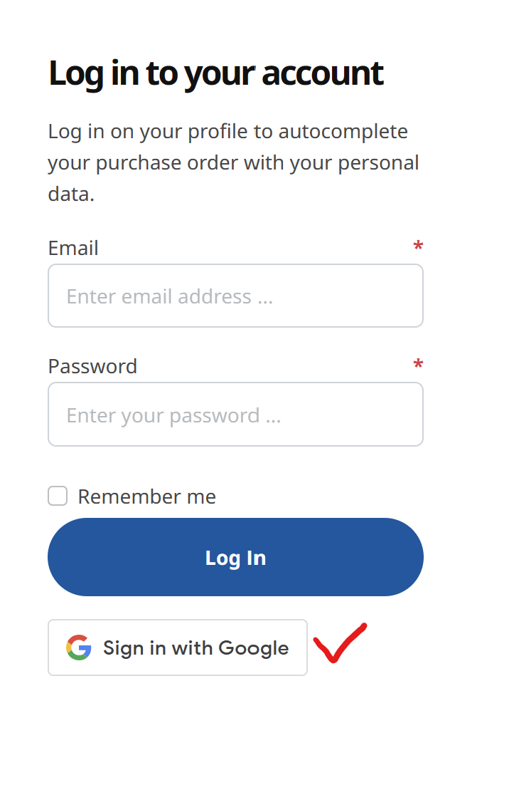
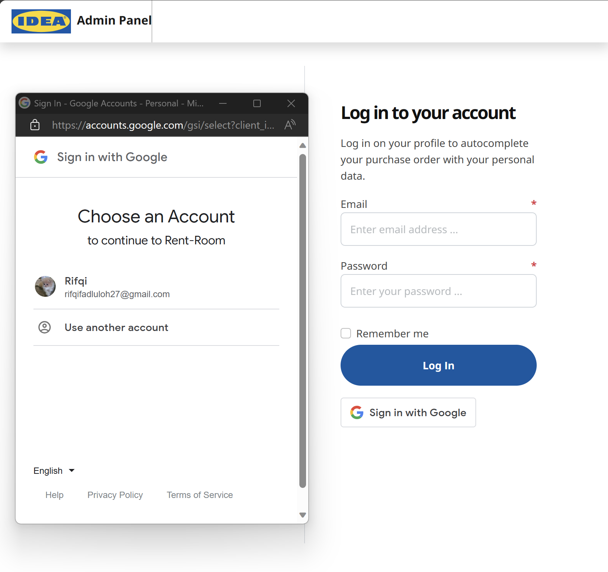

# 🚀 Get started here

RESTful API CRUD operations (GET, POST, PUT, PATCH, DELETE)

# 🔖 RESTful endpoint

### Step 1: Send requests

RESTful APIs allow you to perform CRUD (Create, Read, Update, and Delete) operations using the POST, GET, PUT, PATCH and DELETE HTTP methods.

### Step 2: View responses

-   Observe the response tab for status code (200 OK), response time, and size.

```js
[
    ...,
    {
    name: string,
    facility: string,
    roomCapacity: integer,
    imageUrl: string,
    authorId: integer,
    location: string,
    price: integer,
    typeId: integer,
    updatedAt: date,
    createdAt: date
    },
    ...
]

```

-   Observe the response tab for status code (201 Created), response time, and size.

```js
{
    name: string,
    facility: string,
    roomCapacity: integer,
    imageUrl: string,
    authorId: integer,
    location: string,
    price: integer,
    typeId: integer,
    updatedAt: date,
    createdAt: date
}

```

-   Observe the response tab for status code (400 Bad Request), response time, and size.

```js
{
    message: [
        "name cannot be empty",
        "facility cannot be empty",
        "roomCapacity cannot be empty",
        "imageUrl cannot be empty",
        "authorId cannot be empty",
        "location cannot be empty",
        "price cannot be empty",
        "typeId cannot be empty",
    ];
}
```

-   Observe the response tab for status code (401 Not Authorized), response time, and size.

```js
{
    message: "Invalid Token";
}
```

-   Observe the response tab for status code (403 Forbidden), response time, and size.

```js
{
    message: "Forbidden";
}
```

-   Observe the response tab for status code (500 Internal server error), response time, and size.

```js
{
    message: "Internal server error";
}
```

### Step 3: POST /Lodging

**Add/Create new data**: Send a POST request to `http://localhost:3000/lodgings`.

-   **Request :**

```http
{
    name: string,
    facility: string,
    roomCapacity: integer,
    imageUrl: string,
    location: string,
    price: integer,
    typeId: integer,
    status: string
}
```

```json
headers : {
    "access_token": "string"
}
```

-   **Response :**

```js
{
    name: "RedDoorz Plus near RSCM Jakarta",
    facility: "Ideal stay option for Couples, Business Tourists and Solo Travellers.\n\nAdditional facilities available in RedDoorz Plus near RSCM Jakarta are; Desk, Non-Smoking Rooms, Car Parking Area.",
    roomCapacity: 2,
    imageUrl: "https://images.reddoorz.com/photos/106124/desktop_hotel_gallery_large_900x600_a02dd378-2f35-48bc-afdf-ceac808b4ed5_2F6e45958c-4a90-4c1a-8b4b-631112cb1b86_2FLEAD_D.webp",
    authorId: 1,
    location: "Jalan Paseban Raya No. 22A RT/RW. 005/003, Kelurahan Paseban, Kecamatan Senen kota, Administrasi Jakarta Pusat.",
    price: 250655,
    typeId: 1,
    status: "Archived"
    updatedAt: "2023-10-02T16:00:22.935Z",
    createdAt: "2023-10-02T16:00:22.935Z"
}
```

### Step 4: GET /Lodging

**Read data**: Send a GET request to `http://localhost:3000/lodgings`.
-   **Request :**
```json
headers : {
    "access_token": "string"
}
```

-   **Response :**

```js
[
    {
        name: "Sans Hotel Puri Indah Jakarta",
        facility: "Popular Leisure, Shopping and Entertainment experiences near the Guest House are;  CBD Puri Indah (700 m), Puri Indah Mall (800 m), Hypermart Puri Indah (850 m), Lippo Mall Puri (950 m), Lotte Mart (3,8 km), Ranch Market Pesanggrahan (2,9 km), Lokbin Meruya Ilir (4,2 km), and The FoodHall (4,2 km).",
        roomCapacity: 2,
        imageUrl: "https://images.reddoorz.com/photos/238492/desktop_hotel_gallery_large_900x600_DSCF7067.webp",
        authorId: 1,
        location: "Jalan Kembangan Raya, No.2, Kembangan, Indonesia, 11610",
        price: 380475,
        typeId: 1,
        createdAt: "2023-10-02T09:27:24.267Z",
        updatedAt: "2023-10-02T09:27:24.267Z"
    },
...
]
```

### Step 5: GET /Lodging/:id

**find lodging by id to get data**: Send a GET request to `http://localhost:3000/lodgings/:id`.

-   **Request :**
```json
headers : {
    "access_token": "string"
}
```

-   **Response :**

```js
{
    name: "RedDoorz Plus near Soekarno Hatta Airport 2",
    facility: "Additional facilities available in RedDoorz Plus near Soekarno Hatta Airport 2 are; Desk, Non-Smoking Rooms, Smoking Area, Restaurant, Laundry, Shared Lounge, Room Service, Car Parking Area, and 24-Hours Front Desk.",
    roomCapacity: 2,
    imageUrl: "https://images.reddoorz.com/photos/164842/desktop_hotel_gallery_large_900x600__DDP5851.webp",
    authorId: 1,
    location: "Jl. Raya Perancis Ruko Mutiara Kosambi II No. A3-A5, Dadap-Tangerang, Cengkareng, Benda, Jakarta, Benda, Indonesia, 15211",
    price: 566327,
    typeId: 1,
    createdAt: "2023-10-02T11:19:27.031Z",
    updatedAt: "2023-10-02T11:19:27.031Z"
}
```

### Step 6: DELETE Lodging/:id

**Delete lodging by id to remove data**: Send a DELETE request to `http://localhost:3000/lodgings/:id`.

-   **Request :**
```json
headers : {
    "access_token": "string"
}
```

-   **Response :**

```js
{
    message: "RedDoorz Plus near RSCM Jakarta success to delete";
}
```

### Step 7: GET /Type

**Read data**: Send a GET request to `http://localhost:3000/types`.

-   **Request :**
```json
headers : {
    "access_token": "string"
}
```

-   **Response :**

```js
[
    {
        id: 1,
        name: "RedDoorz",
        createdAt: "2023-10-02T09:27:24.258Z",
        updatedAt: "2023-10-02T09:27:24.258Z"
    },
...
]
```

### Step 8: POST /Type

**Add/Create new data**: Send a POST request to `http://localhost:3000/types`.

-   **Request :**

```http
{
    name: string,
}
```

```json
headers : {
    "access_token": "string"
}
```

-   **Response :**

```js
[
    {
        id: 1,
        name: "RedDoorz",
        createdAt: "2023-10-02T09:27:24.258Z",
        updatedAt: "2023-10-02T09:27:24.258Z"
    },
...
]
```

### Step 9: POST /Register

**Create new admin**: Send a POST request to `http://localhost:3000/register`.

-   **Request :**

```http
{
    username: string,
    email: string,
    password: string,
    role: string,
    phoneNumber: string,
    address: string,
}
```

-   **Response :**

```js
{
    message: `User with id ${id} has been created`;
}
```

### Step 10: POST /Login

**Create new admin**: Send a POST request to `http://localhost:3000/login`.

-   **Request :**

```http
{
    email: string,
    password: string,
}
```

-   **Response :**

```http
{
    access_token: string
}
```

### Step 11: POST /Google-sign-in

**Create new staff**: Send a POST request to `http://localhost:3000/google-sign-in`.

-   **Request :**
    
    
    `
-   **Response :**

```http
{
    access_token: string,
    id: integer,
    username: string
}
```

### Step 12: PUT /Lodgings/:id/edit

**Modify data lodging**: Send a PUT request to `http://localhost:3000/lodgings/:id/edit`.

-   **Request :**

```http
{
    name: string,
    facility: string,
    roomCapacity: integer,
    imageUrl: string,
    location: string,
    price: integer,
    typeId: integer,
    status: string
}
```

```json
headers : {
    "access_token": "string"
}
```

-   **Response :**

```json
{
    "name": "RedDoorz Plus Jakarta",
    "facility": "Ideal stay option for Couples, Business Tourists and Solo Travellers.\n\nAdditional facilities available in RedDoorz Plus near RSCM Jakarta are; Desk, Non-Smoking Rooms, Car Parking Area.",
    "roomCapacity": 2,
    "imageUrl": "https://images.reddoorz.com/photos/106124/desktop_hotel_gallery_large_900x600_a02dd378-2f35-48bc-afdf-ceac808b4ed5_2F6e45958c-4a90-4c1a-8b4b-631112cb1b86_2FLEAD_D.webp",
    "authorId": 1,
    "location": "Jalan Paseban Raya No. 22A RT/RW. 005/003, Kelurahan Paseban, Kecamatan Senen kota, Administrasi Jakarta Pusat.",
    "price": 340655,
    "typeId": 1,
    "status": "Active",
    "updatedAt": "2023-10-02T16:00:22.935Z",
    "createdAt": "2023-10-02T16:00:22.935Z"
}
```

### Step 13: PATCH /Lodgings/:id/status

**Modify status lodging**: Send a PATCH request to `http://localhost:3000/lodgings/:id/status`.

-   **Request :**

```http
{
    status: string
}
```

```json
headers : {
    "access_token": "string"
}
```

-   **Response :**

```json
{
    "name": "RedDoorz Plus Jakarta",
    "facility": "Ideal stay option for Couples, Business Tourists and Solo Travellers.\n\nAdditional facilities available in RedDoorz Plus near RSCM Jakarta are; Desk, Non-Smoking Rooms, Car Parking Area.",
    "roomCapacity": 2,
    "imageUrl": "https://images.reddoorz.com/photos/106124/desktop_hotel_gallery_large_900x600_a02dd378-2f35-48bc-afdf-ceac808b4ed5_2F6e45958c-4a90-4c1a-8b4b-631112cb1b86_2FLEAD_D.webp",
    "authorId": 1,
    "location": "Jalan Paseban Raya No. 22A RT/RW. 005/003, Kelurahan Paseban, Kecamatan Senen kota, Administrasi Jakarta Pusat.",
    "price": 340655,
    "typeId": 1,
    "status": "Archived",
    "updatedAt": "2023-10-02T16:00:22.935Z",
    "createdAt": "2023-10-02T16:00:22.935Z"
}
```

### Step 13: GET /History

**Read data**: Send a GET request to `http://localhost:3000/history`.
-   **Request :**
```json
headers : {
    "access_token": "string"
}
```

-   **Response :**

```json
[
    {
        "id": 3,
        "name": "RedDoorz Plus Jakarta",
        "description": "entity with id 1 status has been updated from Archived to Active by reddoorz",
        "updatedBy": "reddoorz",
        "createdAt": "2023-10-10T13:16:39.552Z",
        "updatedAt": "2023-10-10T13:16:39.552Z"
    },
    "..."
]
```

## 🔐 Authentication and Authorization

### Authentication

To access the API, you need to authenticate using JSON Web Tokens (JWT). Follow these steps:

1. **Obtain JWT Token**: Send a POST request to `http://localhost:3000/login` with your credentials (username and password) to obtain a JWT token.

    - **Request :**

        ```http
        {
          "username": "your_username",
          "password": "your_password"
        }
        ```

    - **Response :**
        ```json
        {
            "access_token": "header.payload.signature"
        }
        ```

2. **Include JWT Token**: Include the JWT token in the `headers` of your requests using the `access_token`.

    ```http
    access_token: your_jwt_token
    ```

### Authorization

Access to certain API endpoints requires specific roles. The following roles are available:

-   admin: Full access to all resources.
-   user: Limited access to specific resources.

You must include the appropriate role in the JWT token's claims to access protected endpoints.

## Error Handling

The API uses standard HTTP status codes to indicate the success or failure of a request. Additionally, error responses include a JSON body with detailed information.

### Error Response Format

In case of an error, the API responds with a JSON object containing the following fields:

-   error: A brief error message describing the issue.
-   status: The HTTP status code associated with the error.
-   message: A detailed error message with additional information (if available).

    -   **Example Response Error**

    ```http
    {
    "message": "Invalid Token"
    }
    ```
    ##
### POST /Pub/Register

**Create new customer**: Send a POST request to `http://localhost:3000/pub/register`

-   **Request :**

```http
{
    email: string,
    password: string,
}
```

-   **Response :**

```js
{
    message: `User with id ${id} has been created`;
}
```

### POST /Pub/Login

**Logs a user into the system.**: Send a POST request to `http://localhost:3000/pub/login`.

-   **Request :**

```http
{
    email: string,
    password: string,
}
```

-   **Response :**

```http
{
    access_token: string
}
```
### GET /Pub/Lodging

**Read data**: Send a GET request to `http://localhost:3000/pub/lodgings`.
-   **Request :**
```json
headers : {
    "access_token": "string"
}
```

-   **Response :**

```json
{
    "data": {
        "count": 20,
        "rows": [
            {
                "id": 1,
                "name": "Cozy Studio Apartment",
                "facility": "Wi-Fi, Kitchen, Free Parking",
                "roomCapacity": 2,
                "imageUrl": "https://a0.muscache.com/im/pictures/826206b8-3894-4992-8213-4c9a10a75b0e.jpg?im_w=1440",
                "authorId": 1,
                "location": "New York City, NY",
                "price": 6234092,
                "typeId": 1,
                "status": "Active",
                "createdAt": "2023-10-18T15:06:07.578Z",
                "updatedAt": "2023-10-18T15:06:07.578Z",
                "Type": {
                    "id": 1,
                    "name": "Cozy Studio Apartment",
                    "createdAt": "2023-10-18T15:06:07.572Z",
                    "updatedAt": "2023-10-18T15:06:07.572Z"
                }
            },
            ...,
        ]
    }
}
```

### GET /Pub/Lodging/:id

**find lodging by id to get data**: Send a GET request to `http://localhost:3000/pub/lodgings/:id`.

-   **Request :**
```json
headers : {
    "access_token": "string"
}
```

-   **Response :**

```json
{
    "data": {
        "id": 1,
        "name": "Cozy Studio Apartment",
        "facility": "Wi-Fi, Kitchen, Free Parking",
        "roomCapacity": 2,
        "imageUrl": "https://a0.muscache.com/im/pictures/826206b8-3894-4992-8213-4c9a10a75b0e.jpg?im_w=1440",
        "authorId": 1,
        "location": "New York City, NY",
        "price": 6234092,
        "typeId": 1,
        "status": "Active",
        "createdAt": "2023-10-18T15:06:07.578Z",
        "updatedAt": "2023-10-18T15:06:07.578Z"
    },
    "QR_CODE": <svg>
}
```

### GET /Pub/Bookmarks

**Read data**: Send a GET request to `http://localhost:3000/pub/bookmarks`.
-   **Request :**
```json
headers : {
    "access_token": "string"
}
```

-   **Response :**

```json
{
    
    "data": [
        {
            "id": 1,
            "CustomerId": 1,
            "LodgingId": 1,
            "createdAt": "2023-10-20T12:52:34.968Z",
            "updatedAt": "2023-10-20T12:52:34.968Z",
            "Lodging": {
                "id": 1,
                "name": "Cozy Studio Apartment",
                "facility": "Wi-Fi, Kitchen, Free Parking",
                "roomCapacity": 2,
                "imageUrl": "https://a0.muscache.com/im/pictures/826206b8-3894-4992-8213-4c9a10a75b0e.jpg?im_w=1440",
                "authorId": 1,
                "location": "New York City, NY",
                "price": 6234092,
                "typeId": 1,
                "status": "Active",
                "createdAt": "2023-10-18T15:06:07.578Z",
                "updatedAt": "2023-10-18T15:06:07.578Z"
            }
        },
        ...,
}
```
### POST /Pub/Bookmarks/:id

**find bookmark by id to add data**: Send a POST request to `http://localhost:3000/pub/bookmarks/:id`.

-   **Request :**
```json
headers : {
    "access_token": "string"
}
```

-   **Response :**

```json
{
    "id": 1,
    "CustomerId": 1,
    "LodgingId": 1,
    "updatedAt": "2023-10-22T17:28:54.900Z",
    "createdAt": "2023-10-22T17:28:54.900Z"
}
```
* Note: This API requires user authentication. Ensure that the user is logged in before accessing this endpoint.